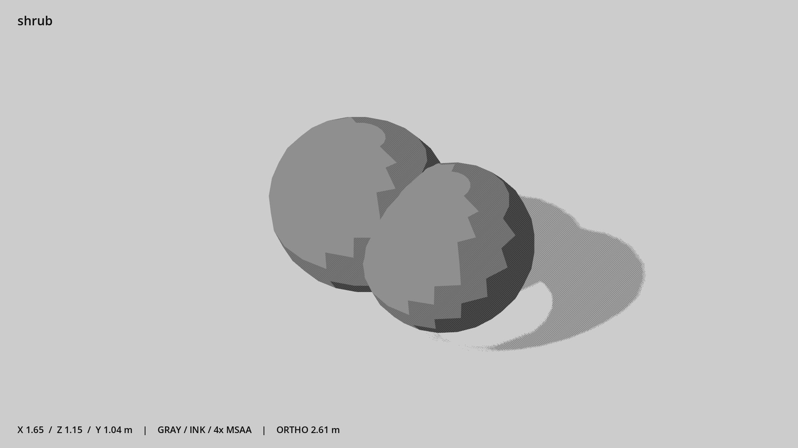

# 灌木 · `shrub`



- 模型：[GLB](../../../../models/shrub.glb)
- 重建脚本：[build_shrub.py](../../../build_shrub.py)；尺寸在开头 `P` 中。
- 依赖：[model_geometry.py](../../../model_geometry.py)
- 实测尺寸：X 宽 **1.65** × Z 深 **1.15** × Y 高 **1.04** 米。
- 色槽：`foliage`。
- 原点：底部接触平面中心；立面和屋顶配件由场景另给安装高度。 +Y 向上，正面/车头/使用面朝 +Z。
- 几何：880 三角面，2 个封闭零件或规范允许的贴花片。
- 设计：两团实心灌木，底面落地。
- 交互参考：无预埋交互节点；由类型库以后标注。
- 来源：本项目原创脚本基本体建模；未使用第三方模型、纹理或生成服务。
- 检查：PASS；0 WARN。无警告。
- 复现：完整重跑后 GLB SHA-256 逐字节相同。

完整检查输出（同时保存为 [shrub.txt](shrub.txt)）：

```text
== C:\Users\Hsinlung\Desktop\news-game\godot\models\shrub.glb
   size  x 1.650  y 1.040  z 1.150 m
   box   min (-0.850, 0.000, -0.500)  max (0.800, 1.040, 0.650)
   triangles 880: foliage 880
   PASS
   EXTRA: outward volume and normal/winding consistency PASS
   SHA256 3c7ff53020377d463f154838a4d0b2d41a23478a3834ad6157cb4c2f8ecb49d2
   REBUILD IDENTICAL
```
