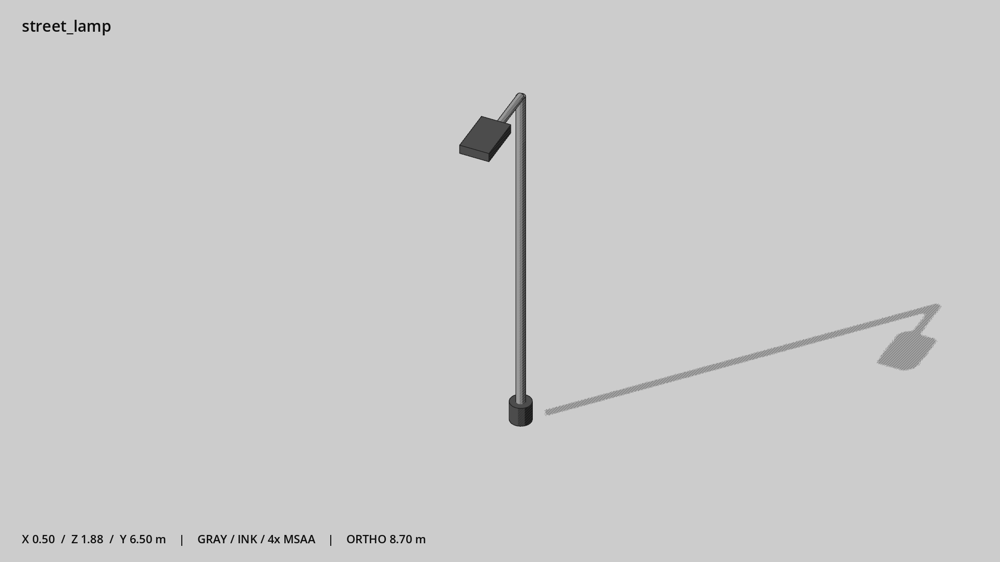

# 街道路灯 · `street_lamp`



- 模型：[GLB](../../../../models/street_lamp.glb)
- 重建脚本：[build_street_lamp.py](../../../build_street_lamp.py)；尺寸在开头 `P` 中。
- 依赖：[model_geometry.py](../../../model_geometry.py)
- 实测尺寸：X 宽 **0.5** × Z 深 **1.88** × Y 高 **6.5** 米。
- 色槽：`accent`, `metal`, `metal_dark`。
- 原点：杆底中心。 +Y 向上，正面/车头/使用面朝 +Z。
- 几何：396 三角面，5 个封闭零件或规范允许的贴花片。
- 设计：6.5 米，灯臂朝 +Z；杆底原点。
- 交互参考：无预埋交互节点；由类型库以后标注。
- 来源：本项目原创脚本基本体建模；未使用第三方模型、纹理或生成服务。
- 检查：PASS；0 WARN。无警告。
- 复现：完整重跑后 GLB SHA-256 逐字节相同。

完整检查输出（同时保存为 [street_lamp.txt](street_lamp.txt)）：

```text
== C:\Users\Hsinlung\Desktop\news-game\godot\models\street_lamp.glb
   size  x 0.500  y 6.500  z 1.880 m
   box   min (-0.250, 0.000, -0.180)  max (0.250, 6.500, 1.700)
   triangles 396: accent 12, metal 248, metal_dark 136
   PASS
   EXTRA: outward volume and normal/winding consistency PASS
   SHA256 7dae9ae431f00028f7761bd98bf6f2f377253c5e1a2d01f68763085357946143
   REBUILD IDENTICAL
```
