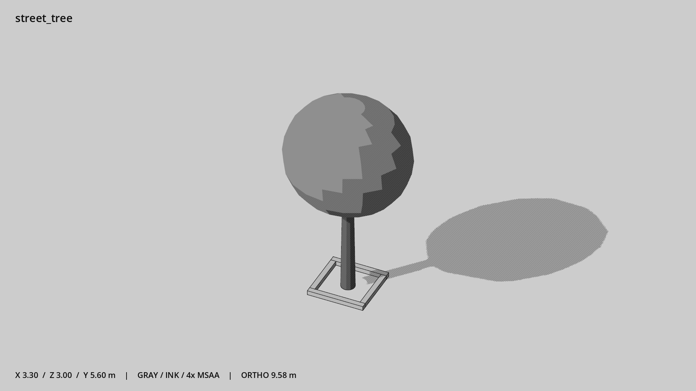

# 行道树与树池 · `street_tree`



- 模型：[GLB](../../../../models/street_tree.glb)
- 重建脚本：[build_street_tree.py](../../../build_street_tree.py)；尺寸在开头 `P` 中。
- 依赖：[model_geometry.py](../../../model_geometry.py)
- 实测尺寸：X 宽 **3.3** × Z 深 **3** × Y 高 **5.6** 米。
- 色槽：`bark`, `concrete`, `foliage`。
- 原点：底部接触平面中心；立面和屋顶配件由场景另给安装高度。 +Y 向上，正面/车头/使用面朝 +Z。
- 几何：860 三角面，8 个封闭零件或规范允许的贴花片。
- 设计：实心椭球树冠，树池四边封闭实体；树干底中心原点。
- 交互参考：无预埋交互节点；由类型库以后标注。
- 来源：本项目原创脚本基本体建模；未使用第三方模型、纹理或生成服务。
- 检查：PASS；0 WARN。无警告。
- 复现：完整重跑后 GLB SHA-256 逐字节相同。

完整检查输出（同时保存为 [street_tree.txt](street_tree.txt)）：

```text
== C:\Users\Hsinlung\Desktop\news-game\godot\models\street_tree.glb
   size  x 3.300  y 5.600  z 3.000 m
   box   min (-1.650, 0.000, -1.500)  max (1.650, 5.600, 1.500)
   triangles 860: bark 372, concrete 48, foliage 440
   PASS
   EXTRA: outward volume and normal/winding consistency PASS
   SHA256 1402cf552c74a66e877b4eb1c8b5da1822b0498276ea1657ff13205eb8a279aa
   REBUILD IDENTICAL
```
