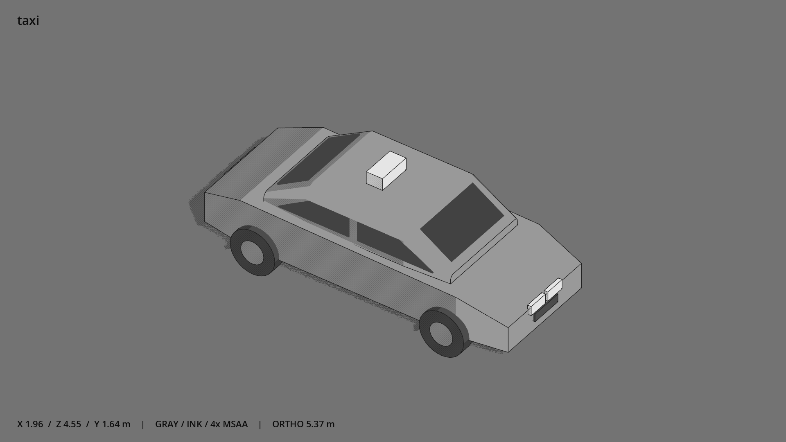

# 出租车 · `taxi`



- 模型：[GLB](../../../../models/taxi.glb)
- 重建脚本：[build_taxi.py](../../../build_taxi.py)；尺寸在开头 `P` 中。
- 依赖：[model_geometry.py](../../../model_geometry.py)、[vehicle_geometry.py](../../../vehicle_geometry.py)
- 实测尺寸：X 宽 **1.96** × Z 深 **4.555** × Y 高 **1.64** 米。
- 色槽：`accent`, `metal`, `metal_dark`, `trim_dark`, `window`。
- 原点：底部接触平面中心；立面和屋顶配件由场景另给安装高度。 +Y 向上，正面/车头/使用面朝 +Z。
- 几何：1252 三角面，23 个封闭零件或规范允许的贴花片。
- 设计：与轿车共用车体，独立车顶灯牌，无文字；车头 +Z。
- 交互参考：无预埋交互节点；由类型库以后标注。
- 来源：本项目原创脚本基本体建模；未使用第三方模型、纹理或生成服务。
- 检查：PASS；0 WARN。无警告。
- 复现：完整重跑后 GLB SHA-256 逐字节相同。

完整检查输出（同时保存为 [taxi.txt](taxi.txt)）：

```text
== C:\Users\Hsinlung\Desktop\news-game\godot\models\taxi.glb
   size  x 1.960  y 1.640  z 4.555 m
   box   min (-0.980, -0.000, -2.277)  max (0.980, 1.640, 2.277)
   triangles 1252: accent 36, metal 600, metal_dark 520, trim_dark 24, window 72
   PASS
   EXTRA: outward volume and normal/winding consistency PASS
   SHA256 fe485387ac2602e62df2f58a8cea0410ff044154821f1dfb9e3991abba6b0be6
   REBUILD IDENTICAL
```
