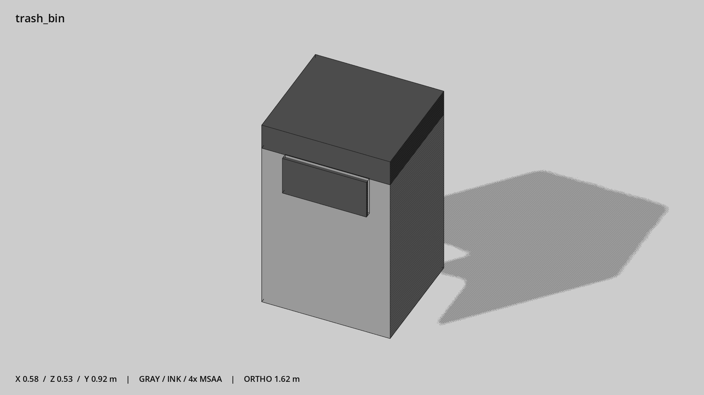

# 垃圾桶 · `trash_bin`



- 模型：[GLB](../../../../models/trash_bin.glb)
- 重建脚本：[build_trash_bin.py](../../../build_trash_bin.py)；尺寸在开头 `P` 中。
- 依赖：[model_geometry.py](../../../model_geometry.py)
- 实测尺寸：X 宽 **0.58** × Z 深 **0.535** × Y 高 **0.92** 米。
- 色槽：`metal`, `metal_dark`。
- 原点：底部接触平面中心；立面和屋顶配件由场景另给安装高度。 +Y 向上，正面/车头/使用面朝 +Z。
- 几何：36 三角面，3 个封闭零件或规范允许的贴花片。
- 设计：投口为不透明深色封板，不留通视洞。
- 交互参考：无预埋交互节点；由类型库以后标注。
- 来源：本项目原创脚本基本体建模；未使用第三方模型、纹理或生成服务。
- 检查：PASS；0 WARN。无警告。
- 复现：完整重跑后 GLB SHA-256 逐字节相同。

完整检查输出（同时保存为 [trash_bin.txt](trash_bin.txt)）：

```text
== C:\Users\Hsinlung\Desktop\news-game\godot\models\trash_bin.glb
   size  x 0.580  y 0.920  z 0.535 m
   box   min (-0.290, 0.000, -0.260)  max (0.290, 0.920, 0.275)
   triangles 36: metal 12, metal_dark 24
   PASS
   EXTRA: outward volume and normal/winding consistency PASS
   SHA256 65f8f8ee6f3ebbe2cd15d236cdccadc242559828be273602eed013213e701c53
   REBUILD IDENTICAL
```
