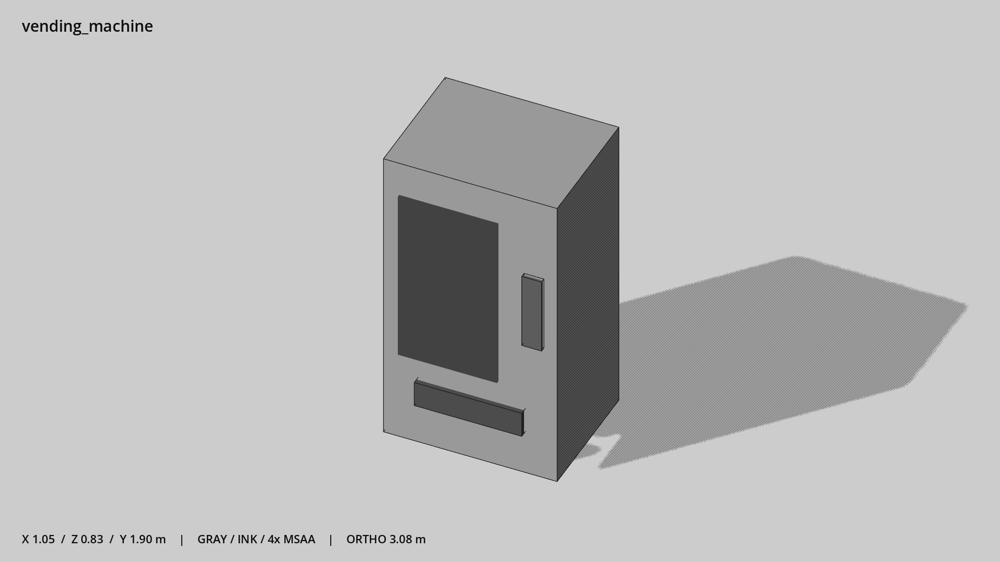

# 自动售货机 · `vending_machine`



- 模型：[GLB](../../../../models/vending_machine.glb)
- 重建脚本：[build_vending_machine.py](../../../build_vending_machine.py)；尺寸在开头 `P` 中。
- 依赖：[model_geometry.py](../../../model_geometry.py)
- 实测尺寸：X 宽 **1.05** × Z 深 **0.83** × Y 高 **1.9** 米。
- 色槽：`metal`, `metal_dark`, `trim_dark`, `window`。
- 原点：底部接触平面中心；立面和屋顶配件由场景另给安装高度。 +Y 向上，正面/车头/使用面朝 +Z。
- 几何：48 三角面，4 个封闭零件或规范允许的贴花片。
- 设计：正面暗色陈列窗、控制面板和取货口；全不透明。
- 交互参考：取货站位 (0,0,1)。
- 来源：本项目原创脚本基本体建模；未使用第三方模型、纹理或生成服务。
- 检查：PASS；0 WARN。无警告。
- 复现：完整重跑后 GLB SHA-256 逐字节相同。

完整检查输出（同时保存为 [vending_machine.txt](vending_machine.txt)）：

```text
== C:\Users\Hsinlung\Desktop\news-game\godot\models\vending_machine.glb
   size  x 1.050  y 1.900  z 0.830 m
   box   min (-0.525, 0.000, -0.400)  max (0.525, 1.900, 0.430)
   triangles 48: metal 12, metal_dark 12, trim_dark 12, window 12
   PASS
   EXTRA: outward volume and normal/winding consistency PASS
   SHA256 3c827301bb4f25ed0cb5fff1e871f318199260f1afff7268ba17cb20a2ecc0e3
   REBUILD IDENTICAL
```
