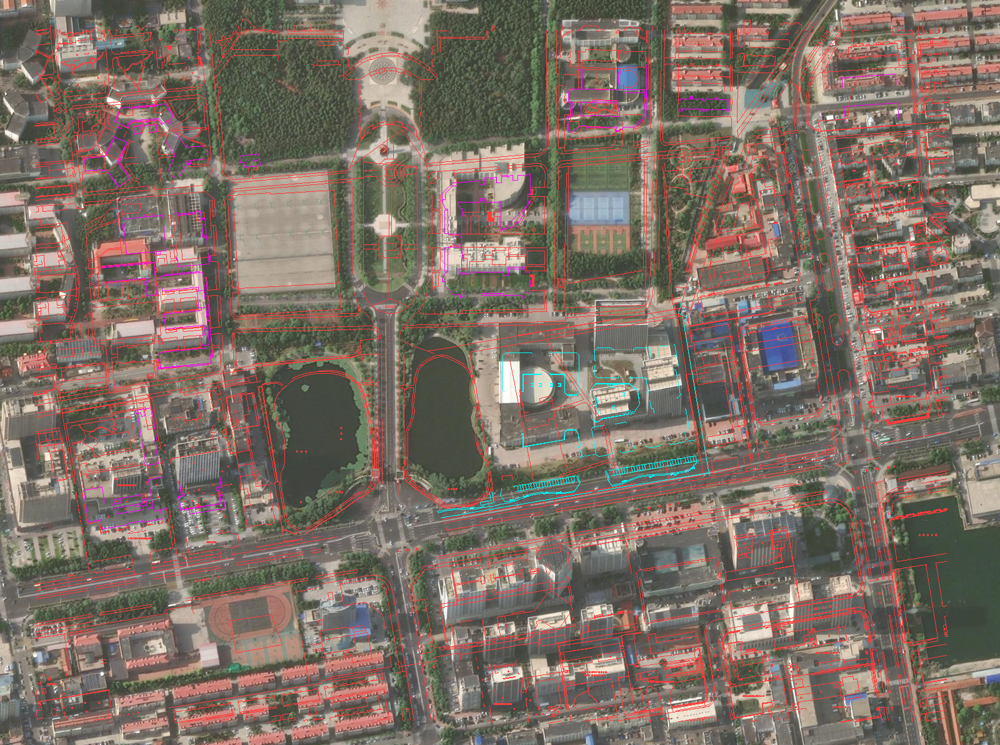
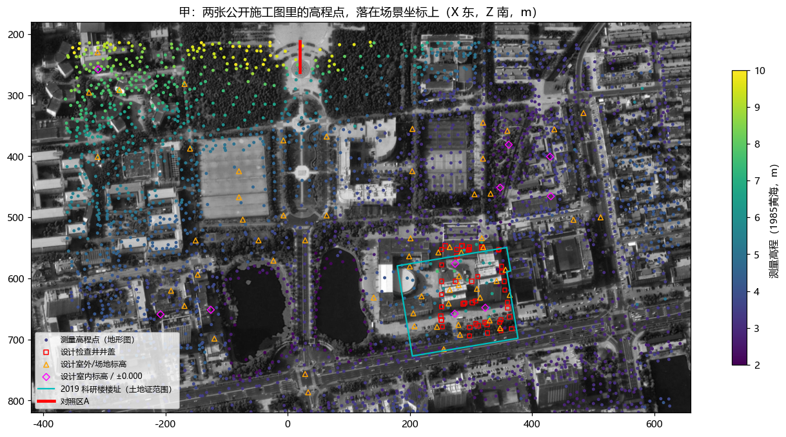
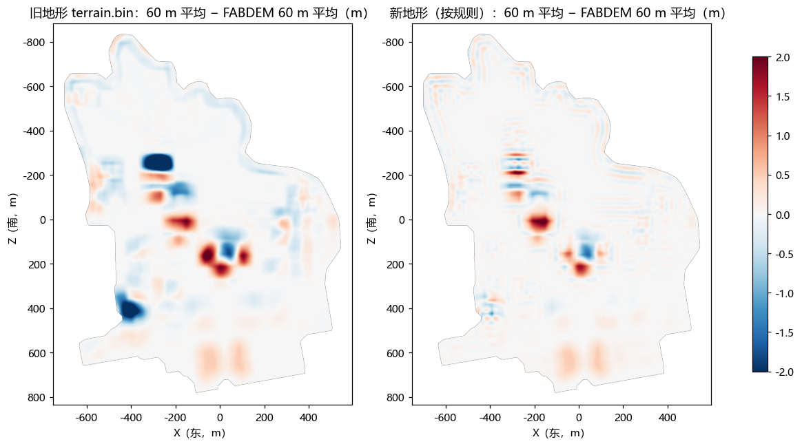
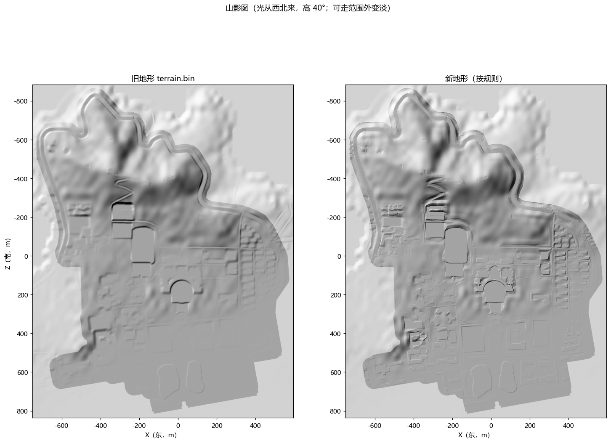
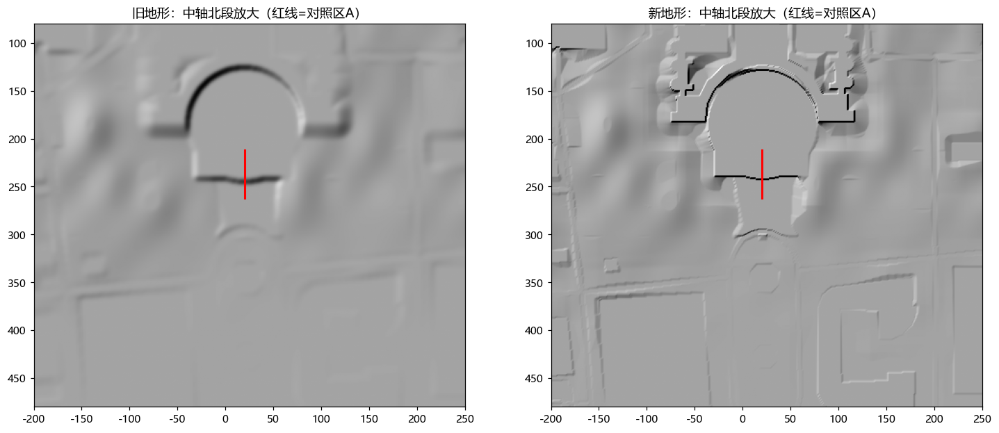
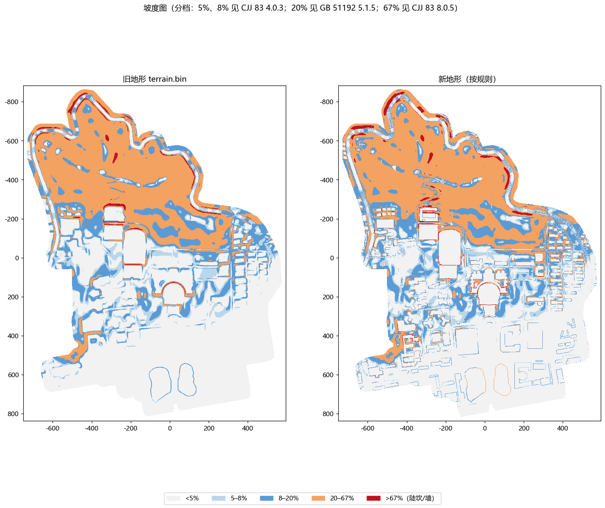
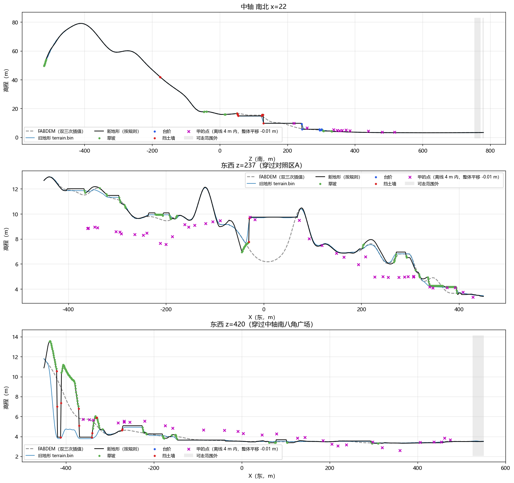
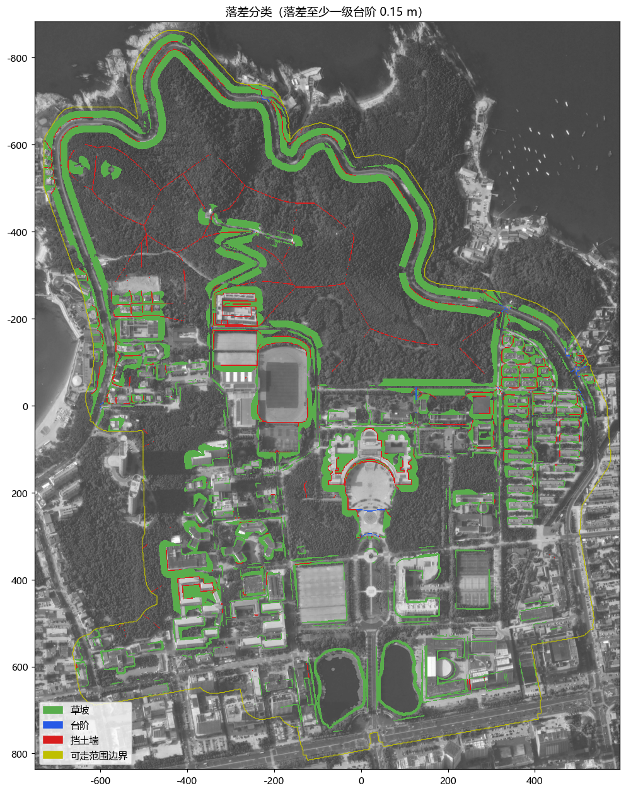
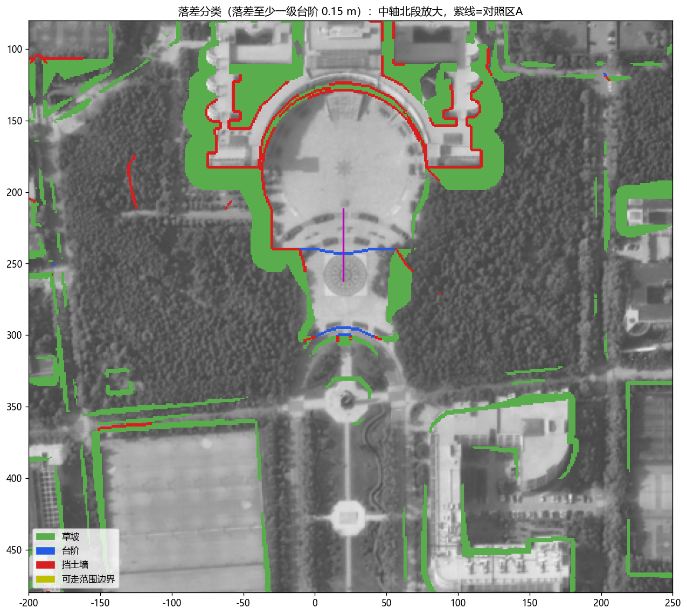

# 山大威海校区地形补全：第二轮试验

2026-09-29。只试，不改场景。坐标都是场景坐标：X 朝东、Z 朝南、单位米。

本目录的脚本：

| 脚本 | 做什么 |
|---|---|
| `dwg_extract.py` | 从总平面图里取出测量高程点、设计标高、线条 |
| `align_plan.py` | 把图纸坐标对到场景坐标 |
| `overlay_plan.py` | 把对好的图纸线条画在卫星图上，用来检查 |
| `points.py` | 做点表（`points.csv`） |
| `gen_terrain.py` | 乙：按规则生成地形和落差分类图 |
| `analyze.py` | 所有检验和图（`fig/`、`stats.json`） |

下载的招标文件、转换后的图纸、生成的高度场都在 `raw/`（不提交）。

为了读图纸，经 Hsinlung 同意，装了两样东西：LibreDWG 免安装版，解压在 `D:\tools\libredwg`，用来把图纸转成可读的格式；另外用 pip 给 `D:\anaconda` 装了 ezdxf 1.4.4，用来读转换后的图纸。

## 甲

结论：威海市公共资源交易网上能公开下载到两栋科研楼（新工科与交叉学科科研楼、材料与空间科学科研楼）的全套施工图。里面的总平面图底图是一张实测地形图，从中取到 1881 个落在校园里的实测高程点，覆盖校园南半部（Z 213 到 760）。另有 117 个设计标高和检查井井盖标高。拿这些点检验：旧地形和新地形离实测一样远（整体平移后，差的均方根 0.96 m 和 0.96 m），新地形没有更好。SDUcraft 的 Minecraft 存档没找到公开下载。

### 查到或量到的

**招标文件。** 在交易网的全文检索里搜"山东大学"，共 296 条公告，其中约 35 个项目的招标人是山东大学（威海），时间在 2017–2026 年。逐个打开公告页，其中 23 个页面带公开附件，共 30 个文件，约 420 MB，都放在 `raw/tender/`（清单在 `raw/tender/index.json`）。下载地址是交易网链接到的 `60.212.191.165:10000`，不用登录。有用的只有一个包：

- `680030_山大科研楼图纸（去网络机房）9.20.zip`，在"材料与空间科学科研楼工程施工总承包招标文件第1版澄清"页面下，2019-09-30 发布（<https://ggzyjy.weihai.cn/jyxx/003001/003001006/20190930/9c2c3275-a654-4838-97ff-a4a2b7cbcef7.html>）。里面是两栋楼的施工图，格式是 AutoCAD 2004 的图纸文件。
  - `山大总图 -调整_t6.dwg`：总平面图。图上写着"高程采用1985黄海高程""坐标采用威海97坐标系"。底图是实测地形图（图层"地形"），有 3584 个高程点（测量符号加数字，范围 1.8–10.4 m）。设计标注有 43 个标高符号（"室外标高""室内标高"），另有 22 条道路坡度标注。
  - `山大室外给排水_t3.dwg`：室外给排水图。检查井成对标着"井盖/管内底"两个数，例如 Y1 标"3.700/2.900"。场地标高有 27 个，其中有"4.450（±0.00）"，即新楼首层地面的绝对标高是 4.450 m。这张图的坐标整体平移了 (3200.662, 297.265)：两张图共有的图层（用地红线、地下车库、楼轮廓、建筑退线）平移后到毫米都对得上。
  - 两栋楼的建筑图本身（`…图审.dwg`）转出来的文字里没有"±0.000 相当于绝对标高"这句。那句话很可能在图框或专用对象里，转换工具读不出来。只有给排水图里的"4.450（±0.00）"给出了这个数。
- 其余项目的附件都是资格预审文件、招标文件正文、答疑。文字里搜"标高、绝对、黄海、井盖、室外地坪"等词，没有带位置的高程数字。2021 年的"新工科与交叉学科科研楼室外景观工程"、研究生公寓 EPC 等室外工程的页面上没有附件。
- 没有去山大威海招标采购网（`zbb.wh.sdu.edu.cn`）下载。

**怎么落到场景上。** 图纸用的是威海 97 坐标（本地坐标，X 朝北、Y 朝东）。步骤如下：

1. 先用路名粗定：图上"山大路"竖着在图纸 x≈85572，OSM 的山大路在场景 X≈26；图上"文化路"在图纸 y≈62720，OSM 的文化西路在场景 Z≈750。
2. 再用图纸上的闭合轮廓去贴 OSM 楼轮廓，求旋转、平移、缩放。结果：旋转 0.016°，缩放 0.998，贴上的边与 OSM 边的距离中位数 1.4 m。只有两成的图纸边贴得上 OSM，因为地形图上很多楼 OSM 里没有，或已经拆了。
3. 把对好的线条画在卫星图上（下图）：湖岸、路、楼大体都对上，误差 1–2 m。

每个高程点的位置取测量符号的圆点（2147 个），没有圆点的取数字左下方 0.8 m（这是这张图里数字相对圆点最常见的偏移）。检查井取离数字最近的井符号。每个点怎么定的都写在点表里。

**点表。** `points.csv`，共 3377 行，含校园外的点。列依次是：类别、来源文件、文件里的位置（图层，检查井写井号）、原文数字、场景 X/Z、位置怎么定的、在不在校园范围、在不在 2019 楼址内、FABDEM/旧地形/新地形在该点的值、平移后的差。图纸没有页码，"文件里的位置"写的是图层。落在校园范围里的点有：

| 类别 | 楼址外 | 2019 楼址内 |
|---|---|---|
| 测量高程点（地形图） | 1881 | 74 |
| 总图上标的室外/室内标高（没写是现状还是设计） | 39 | 0 |
| 给排水图上的场地标高、±0.000 | 8 | 22 |
| 设计检查井井盖 | 11 | 37 |

**高程基准的处理。** 图纸是 1985 国家高程基准，FABDEM 用的是另一个基准。这里用全部点求一个整体平移，再比较剩下的差：对每种地形，平移量取"点减地形"的中位数。三组点分开算，因为它们代表的时间不同（见"推断的"）。

**逐点和总体的差**（每点的差在 `points.csv`；总体的数在 `stats.json`）：

| 点组 | 地形 | 整体平移（点−地形的中位数） | 平移后差的平均绝对值 | 均方根 | 九成的点在 | 最大 | 只看小尺度的均方根 |
|---|---|---|---|---|---|---|---|
| 测量点，楼址外，1881 个 | FABDEM | +0.01 | 0.72 | 0.94 | 1.48 内 | 3.74 | 0.33 |
| | 旧地形 | +0.01 | 0.72 | 0.96 | 1.53 内 | 3.70 | 0.36 |
| | 新地形 | −0.01 | 0.73 | 0.96 | 1.53 内 | 4.49 | 0.40 |
| 设计点，楼址内，59 个 | FABDEM | +0.74 | 0.15 | 0.27 | 0.27 内 | 1.46 | 0.22 |
| | 旧地形 | +0.74 | 0.15 | 0.27 | 0.27 内 | 1.47 | 0.22 |
| | 新地形 | +0.69 | 0.15 | 0.26 | 0.31 内 | 1.40 | 0.22 |
| 设计点，楼址外，58 个 | FABDEM | +0.53 | 0.43 | 0.73 | 0.85 内 | 3.06 | 0.12 |
| | 旧地形 | +0.53 | 0.45 | 0.74 | 0.98 内 | 3.00 | 0.12 |
| | 新地形 | +0.40 | 0.44 | 0.72 | 0.90 内 | 2.91 | 0.14 |

单位都是米。"只看小尺度"是这样算的：每个点减去它周围 30 m 内同组点的平均，地形值也同样减，再比两者的差。这样去掉了大尺度起伏的误差，只看规则要管的那部分。

测量点自身的小尺度起伏（标准差）是 0.31 m。三种地形在同样的点上分别是 FABDEM 0.20、旧地形 0.23、新地形 0.29。新地形的小尺度起伏大小接近实测，但起伏的位置不对，所以差反而变大。

**对照区 A 附近的实测点**（X 20±25，Z 190–320，整体平移按 +0.01 m）：

| Z | 实测 | 旧地形 | 新地形 |
|---|---|---|---|
| 219 | 9.78 | 9.74 | 9.74 |
| 228 | 9.71 | 9.74 | 9.74 |
| 242 | 9.37 | 9.41 | 9.44 |
| 250 | 7.91 | 5.77 | 5.60 |
| 256 | 7.93 | 5.65 | 5.60 |
| 257–258 | 7.66、6.71 | 5.65 | 5.60 |
| 264–290 | 5.95–6.68（6 个点） | 5.29–5.65 | 4.86–5.60 |

**Minecraft 存档。** 只找到 B 站视频"【Minecraft】MC还原山东大学威海校区，献礼山大百廿校庆"（BV1x34y1S7bg，UP 主"昊昊吃西瓜"，2021 年）。简介里没有下载链接。Minecraft 高校联盟网站上 SDUcraft 的介绍页（<https://www.mualliance.cn/archives/1101>）只说做过八个校区的还原，没有下载。高校联盟的"复原项目"栏目里没有山大。按规定没加群、没私信，所以"一格是否等于 1 m"量不出。

**访问情况。**

- 能正常用的：交易网、它链到的下载服务器、B 站搜索。
- 打不开或被拦的（都不是主要来源，另有渠道补上了，所以没有停下）：
  - MineBBS：返回 468 和防火墙验证页。
  - mcbbs.net：连不上。
  - 山东省政府采购网 `ccgp-shandong.gov.cn`：连不上。
  - 规范网站 `zzguifan.com`：连接超时。
  - `zhulouren.com`：403。
  - B 站视频详情接口：返回的不是数据，改用网页。

  这些是不是因为境外出口 IP 被拦，判断不了。没改代理设置。

### 推断的

- **测量年份量不出。** 地形图上的校名写的是"山东大学威海分校"，2019 年的新楼位置在图上还是旧房子，所以这张地形图比 2019 年早，具体哪年图上没写。FABDEM 来自 2011–2015 年的雷达测量（这是公开资料里的说法，这次没核实）。两者谁更新，判断不了。
- **基准差看不出来。** 测量点对 FABDEM 的整体平移只有 +0.01 m，所以两种基准之间的常数差，在这批点上小到看不出来（点本身的离散有 0.94 m）。
- **楼址内的设计点整体比 FABDEM 高 0.7 m，原因量不出。** 楼址内的 74 个旧测量点从 2.7 m 到 6.3 m 不等（中位数 4.5 m），设计的场地标高是 3.6–4.1 m，首层 4.45 m。所以建楼时是把高处挖低、低处填高，整平到 4 m 左右，不是整体填高。为什么 FABDEM 在这里比设计值低 0.7 m，而楼址外的测量点和 FABDEM 平均几乎没差，这次判断不了。
- **西边宿舍区实测比 FABDEM 低 2–3 m。** z=237 剖面上 X −370 到 −190 一段都是这样，东边则大体对得上。FABDEM 在楼密、树密的地方把地面估高是常见的毛病，但这里是不是这个原因，量不出。
- **推断断在这里：** 实测点证明校内确实有 FABDEM 看不见的小尺度落差（对照区 A 的实测就是分两级下降的），但只能检验，不能用来生成。这批点只覆盖校园南半部，北边的山坡、主楼一带（第一轮的 B、C 两处）都没有点，那里对不对量不出。

## 乙

结论：按规范规则在 FABDEM 上生成的地形，在 60 m 尺度上和 FABDEM 平均只差 0.08 m，比旧地形（0.16 m）更守住了大尺度起伏。但它给出的小尺度落差和实测点对不上：新地形离实测和旧地形一样远，只看小尺度还略差（0.40 m 对 0.36 m）。原因是落差放在哪，全靠第一步的形状（OSM 楼轮廓、手描平台）来定，而真实的台阶、分级不一定在这些形状的边上。

### 查到或量到的

**规则的数字和出处。** 规范原文存在 `raw/codes/`。

| 规则 | 用的数 | 出处 | 怎么用的 |
|---|---|---|---|
| 车行道最大纵坡 | 8% | GB 50352-2019《民用建筑设计统一标准》5.3.2 第 1 款："基地内机动车道的纵坡不应小于0.3%，且不应大于8%" | 校内所有车行道 |
| 特殊路段 | 11%，坡长不超过 100 m；山地可适当放宽 | 同上第 1 款、第 5 款 | 路段在 100 m 内的平均坡度，如果 FABDEM 本身就超过 8%，就按 FABDEM 自己的坡度（见下） |
| 步行道最大纵坡，超过改台阶 | 8% | 同上第 3 款："当大于极限坡度时，应设置为台阶步道" | 连接路网的长步道 |
| 台阶 | 踏步宽不小于 0.30 m、高不大于 0.15 m，即坡度 0.5 | GB 50352-2019 6.7.1 第 1 款；CJJ 83-2016《城乡建设用地竖向规划规范》5.0.4 第 2 款："踏步最大步高宜为0.15m" | 台阶的坡度上限；低于一级台阶（0.15 m）的高差不算落差 |
| 草坡的缓坡 | 20% | GB 51192-2016《公园设计规范》5.1.5："游憩绿地适宜坡度宜为5.0%～20.0%" | 空间够时，草坡用 20% |
| 草坡最陡 | 坡比 0.67（1:1.5） | CJJ 83-2016 8.0.5："土质护坡的坡比值不应大于0.67" | 空间不够时，草坡最陡到 0.67 |
| 多高以上用挡墙 | 3.0 m | CJJ 83-2016 8.0.5："相邻台地间的高差宜为1.5m～3.0m，台地间宜采取护坡连接……大于或等于3.0m时，宜采取挡土墙结合放坡方式处理，挡土墙高度不宜高于6m" | 高差超过 3.0 m 的部分做成墙，3.0 m 以内的部分放坡 |
| 首层比室外高 | 0.15 m | GB 50037-2013《建筑地面设计规范》3.1.5："建筑物的底层地面标高，宜高出室外地面150mm" | 楼基整平后，楼内再高 0.15 m |
| 坡度图的分档 | 5%、8% | CJJ 83-2016 4.0.3（小于 5% 宜平坡式，大于 8% 宜台阶式）；GB 50352-2019 5.3.1 | 只用来画坡度图 |

查了但没用上、或没查到的：

- **草坡的最大坡度**：现行 GB 51192-2016 表 5.1.4 只给最小坡度（草地 1%），没给最大。搜索结果的摘要里说旧规范 CJJ 48-92 写的是"草地最大 33%"，但原文没打开，没核实，所以没用，改用 CJJ 83-2016 8.0.5 的土质护坡 0.67 作为最陡。
- **城市道路的纵坡表**：CJJ 83-2016 表 5.0.2-1 在网页上是图片，读不到。《城市道路工程设计规范》CJJ 37 没打开。校内道路按 GB 50352 的"基地内道路"取值。
- **积雪或冰冻地区**：规范另有更严的数（步行道 4%，特殊路段 6%，GB 50352-2019 5.3.2）。没查到威海算不算这类地区，所以用一般值。
- **路面横坡**：规范要求 1%–2%（GB 50352-2019 5.3.2）。按任务要求做成水平，没用这个数。
- **室外坡道**：不陡于 1:10（GB 50352-2019 6.7.2）。这一版没有做坡道，没用。
- **广场坡度**：0.3%–3%（CJJ 83-2016 5.0.3）。按任务要求做成平的，没用。

**做法**（`gen_terrain.py`）。网格和 `terrain.bin` 完全相同：1 m 一格，1346×1720，起点 (−751, −884)。所有设置照 `build_ground.py` 的读数据函数来，没改那个文件。

1. **平的东西**：球场（套在大场地里的小场地跟大场地同高）、OSM 里标成面状的广场、楼基、第一步手描的四个平台、湖（水位同 `build_ground`，加 0.5 m 石岸）。每块取它范围内的中位数做高度。楼内再高 0.15 m。
2. **路**：路中线上取高度，沿线平滑（沿用第一步的 12 m），横向水平。纵向限在 8% 内。超出的地方，把"整段都挖"和"整段都填"两种做法取平均，挖填各半。路口和并行的路互相取平均，避免路面上出台阶。步行道陡过 8% 的地方标成台阶。
3. **空地**：跟着 FABDEM 走。紧挨平地的地方先和平地同高，再以草坡接回 FABDEM。
   - 空间够（离对面那块平地的一半距离以内放得下），坡度用 20%。
   - 不够就变陡，最陡 0.67。
   - 还不够，剩下的高差在两块平地的正中间变成一道坎。两边都是人走的（路、广场、平台），这道坎算台阶；否则算挡土墙。
   - 高差超过 3 m 的部分，在平地边上直接做成墙。
4. **守住大尺度**：算出新地形和 FABDEM 各自的 60 m 方块平均，把差补到空地上，重复 12 遍，取最好的一遍。最后不做任何平滑。

   试过把差补到所有格子上。那样平地的中位数会跟着漂，12 遍后平均差从 0.08 m 回升到 0.12 m，最大差涨到 4.6 m。所以只补空地，每遍补一半。

   只补空地又出了新问题：斜坡上的大楼基比周围低很多时，补回去的土全堆到旁边空地上，堆出过 14 m 的土包（z=420 剖面 X −430 一带）。所以加了一条限制：空地不高过它周围 60 m 内 FABDEM 的最高点，也不低过最低点。这条限制规范里没有，是这次自己定的，理由是"规则只能搬动落差，不能凭空造出落差"。

**输出**（都在 `raw/`，格式同 `terrain.bin/json`）：

- `terrain_rules.bin`、`terrain_rules.json`：新地形。
- `drop_class.bin`、`drop_class.json`：每格一个字节，0 无、1 草坡、2 台阶、3 挡土墙。
- `drop_m.bin`：台阶或墙那一格的坎高。
- `gen_summary.json`：规则的数、超 8% 的路段、每一遍的平均差。

**60 m 尺度上和 FABDEM 的差**（只算整个 60 m 方块都在校园范围里的格子，共 127 万格）：

| | 平均 | 平均绝对值 | 95% 的格子在 | 最大 | 最大出现在 | 空地上的最大 |
|---|---|---|---|---|---|---|
| 旧地形 | −0.03 | 0.16 | 0.69 内 | 6.62 | (−263.5, −245.5)，一栋楼的楼基 | 6.32 |
| 新地形 | +0.02 | 0.08 | 0.36 内 | 2.43 | (−154.5, 9.5)，体育场中间的足球场 | 1.34 |

新地形最大差出在体育场，因为一块一百多米长的平地放在斜坡上，60 m 平均在它里面没法和 FABDEM 一致。这是"平地必须平"和"60 m 平均必须一致"两条要求本身的冲突，不是计算没收敛。

**落差分类的统计**（校园范围内）：

| 类型 | 多少处 | 大小 | 坎高 |
|---|---|---|---|
| 草坡 | 867 块 | 共 21.1 公顷 | |
| 挡土墙 | 427 段 | 约 10.6 km | 每段最高处的中位数 0.25 m；29 段超过 1.5 m，16 段超过 3 m，最高 15.1 m |
| 台阶 | 50 段 | 约 370 m | 每段最高处的中位数 0.31 m，5 段超过 1.5 m |

另有 30 m 步行道陡过 8%，整段标成台阶。

最高的几道墙都是"整栋楼一个平楼基"放在陡坡上造成的：

- 15.1 m：X −335…−242，Z −259…−224，北山坡上的一栋楼；
- 6.9 m 三处：X −423…−368，Z 392…440；X −76…−23，Z 141…183；X −412…−377，Z 411…436；
- 6.4 m：体育场北边。

**超过 8% 的路。** 11 段，共约 2.1 km。FABDEM 自己在 100 m 内的平均坡度就超过 8%，这些路按 FABDEM 的坡度保留，没压到 8%。最长的是北山上的路，X −345…−242、Z −96…−401，长 481 m，最陡 21%。逐段列表在 `raw/gen_summary.json`。

**图。**

**对照区 A**（X 20，图书馆广场和罗盘广场交界）。沿 X=20 从 Z 150 看到 310：

- 新地形在 Z 242–243 有一道 4.14 m 的坎：上面是图书馆广场，高 9.74 m；下面是罗盘广场，高 5.60 m。两边都是手描平台，都是人走的地方，所以算台阶。这道坎顺着两个手描平台的交界，从 X≈−10 延到 X≈55（图上蓝线）。台阶是一道没有水平宽度的竖坎，实际要做成台阶，得占用坎下罗盘广场北边的一条地。
- 旧地形同样是 4 m，但被抹成 Z 240–250 之间约 40% 的斜坡。
- FABDEM 自己是缓缓下降的，从 Z 180 的 9.97 m 降到 Z 290 的 5.09 m。
- 再往南，罗盘广场南边（Z 294–300）和中轴路交界有一道 0.65 m 的台阶，接着是一段草坡。

### 推断的

- **规则只能在已知的形状边上放落差。** 对照区 A 的实测是两级：
  - Z 242–250 之间降约 1.5 m（9.37 → 7.9）；
  - Z 257–264 之间再降约 1.2–1.9 m（7.9 → 6.0–6.7）。

  罗盘广场北边那一条（Z 250–257）实测 7.9 m，比广场主体高近 2 m。新地形把罗盘广场当成一整块平地，所以只能在交界处放一道 4.1 m 的坎，那几个点差了 2.1–2.3 m。**推断在这里断开**：规则知道"平台之间要有落差"，但不知道一块平台内部还分级。分级要从别处来（照片、实测），不能由规则推出。
- **第一轮的两条弧线不是台阶。** 第一轮在 A 处 Z≈221 和 Z≈228 看到两条弧形色差。实测点 Z 219 是 9.78，Z 228 是 9.71，只差 0.07 m，说明那两条弧线不是落差（这条是用甲的点检验出来的，没有拿去调规则）。
- **很多矮墙在现实里是路缘或小坡。** 427 段挡土墙里，一半不到 0.25 m，多是路和楼、路和路直接相邻、中间没有空地的地方。现实里多半是路缘石或一小段坡，这一版没区分。
- **斜坡上的大楼实际多是分层的**（半地下室、分段首层），而"整栋楼一个平楼基"的规则会造出 6–15 m 的墙。要改得有楼的层数或入口标高，这属于第二步的信息。
- **超 8% 的路是按"山地可适当放宽"处理的。** 如果那段路实际没有那么陡，要么是 FABDEM 在山上的起伏本身不准，要么路是盘山绕上去的而 OSM 画成了直的。判断不了。
- **空地的限高限低（不超过周围 60 m 内 FABDEM 的最高最低）是自己定的，没有规范出处。** 去掉它会出现 14 m 的土包，留着它，60 m 平均的差在少数地方会比不加时稍大（平均绝对值 0.079 → 0.084 m）。
- **换地方能不能用。** 规则本身只用了 FABDEM、OSM 的路网和楼轮廓，以及第一步的手描平台，数字都来自国家规范，换地方可以照用。但这次检验说明，它给出的是"像是设计过的"地形，不是"更接近真实"的地形：在有实测点的地方，它没有比平滑的旧地形更准。
