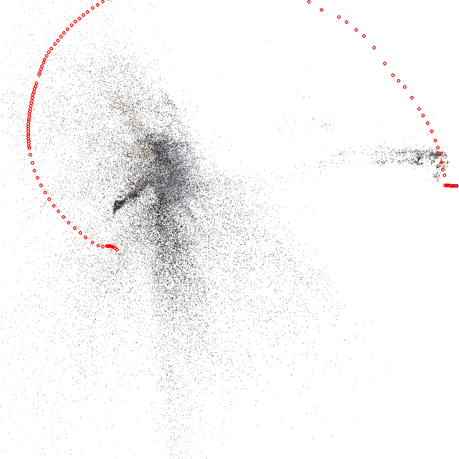
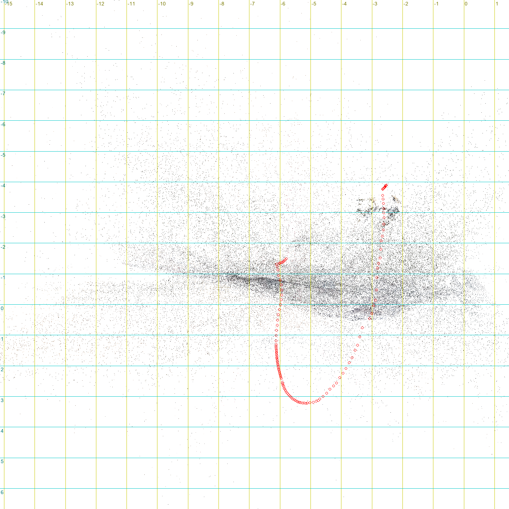

# 山大威海校区地形补全：三个试验

2026-09-29。只试，不改场景。脚本都在本目录：`crop.py`（按原始像素放大卫星图、画格网和标注）、`sun.py`（按拍摄日期算太阳位置）、`measure1.py`（试验一的亮度剖面和两侧高度）、`sheet.py`（视频缩略图）、`trial3.py`（试验三的对齐和剖面）。视频、抽帧、点云在 `raw/`，不提交。

坐标都是场景坐标：X 朝东、Z 朝南、单位米（见 `godot/scenes/sdu_weihai/site.json`）。

## 试验一

结论：这张卫星图只能量出"南北走向、高 1 m 以上、东侧是空地"的边的高差；台阶数不出来，东西走向的台地边（校园里多数就是这种）没有影子，对照区的 4 m 落差在图上看不出来。

### 查到或量到的

**影像的实际清晰度。** 影像按 0.3 m 一个像素下载，但原始拍摄是 0.34 m，服务端对这一带标的采样分辨率是 0.6 m（`imagery/site.json` 里的 `SAMP_RES`）。按原始像素放大看，边缘都糊成 2–3 个像素宽，实际能分辨的大约是 0.6–1 m。一级台阶踏面约 0.3 m 深、0.15 m 高，一级不到一个像素，所以**所有地方都数不清台阶级数**。

**拍摄时刻和太阳。** 影像来源是 Vantor 的 LG03，也就是 WorldView Legion 3 卫星，它不走太阳同步轨道，不一定上午过境。

- 影子方向：学24（OSM 标 17 层，位置 (−355, 121)）东边那栋楼的影子，南北两条边界在 z≈97 和 z≈125，楼底南北范围是 z 99.5–119.5，两者对得上，所以影子朝正东，误差约 ±3°。西边两栋细长高楼（x≈−550）的影子也朝正东。太阳方位角（从正北顺时针量）因此约为 270°±3°。场景坐标的北是 UTM 格网北，和真北差 0.6°，小于这个误差，这里忽略。
- 用拍摄日期 2025-05-19 反推（`sun.py`）：方位角 270° 对应北京时间 15:56，那时的太阳高度角是 **33.9°**，正切 0.672。方位角取 267°–273° 时，时刻在 15:37–16:15 之间，高度角 37.3°–30.0°，正切 0.76–0.58。
- 拿有高度依据的楼校准：OSM 里带层数的楼只有两栋，其中一栋是学24（17 层）。它的影子从东墙墙根 x = −308 一直延到 x ≈ −241（看 z = 102、108、114 三行的亮度剖面，都在 −243…−237 之间变亮），长约 **67 m**。可影子尽头落在树冠上，不在地面上（terrain.bin 两端分别是 13.18 m 和 13.20 m，地面是平的）。

  | 假设 | 高度角 |
  |---|---|
  | 楼高 51–58 m（推断见下），影子尽头在地面上 | 37°–41° |
  | 按上面反推的 33.9°，树冠要有多高才对得上 | 6–13 m |

  松林树冠 6–13 m 是说得通的，但树冠高度量不出来，所以这次校准**只能说不矛盾，缩小不了误差范围**。两个结果都保留：反推 33.9°（30°–37°），校准 37°–41°（前提是树冠高为 0，实际不成立）。

**斜拍偏移的处理。** 学24 的南立面整面都露在图上，屋顶比楼底往北偏了约 19.5 m，东西方向不偏。所以卫星是从南边斜着拍的，偏移只在南北方向，每米高度往北偏约 0.34–0.38 m（按楼高 51–58 m 推算）。影子朝正东，和偏移方向垂直，所以沿东西方向量影子长度不受偏移影响，只要从墙根起量就行。墙是竖直的，墙根和墙顶的东西坐标相同。高 1–2 m 的东西，顶部往北偏 0.4–0.8 m，也就一两个像素，影响可以忽略。

**四处的情况。** 格网 5 m，红线是比较高度时取的两侧点，或者量影子的地方。

| 处 | 位置 | 怎么找到的 | 类型 | 台阶法高差 | 影子法高差 | FABDEM 两侧差值 | terrain.bin 两侧差值 |
|---|---|---|---|---|---|---|---|
| A | 图书馆广场和罗盘广场交界，x 20，比 z 212 和 z 262 | 任务指定（FABDEM 在这里有约 4 m 落差） | 看不出台阶或墙；z≈221 和 z≈228 有两条弧形的浅色差，但分不清是台阶、铺装花纹还是绿篱边 | 数不清 | 量不出：弧线是东西走向，太阳在正西，不投影子 | +2.45 m | +4.09 m |
| B1 | 东区住宅，x 365，z −97 的绿篱带（比 z −103 和 z −91） | 看东区住宅（坡上成排的低层楼），找两排楼之间可能的台地边 | 东西走向的绿篱带，看不出墙面 | 数不清 | 量不出：东西走向，没有影子 | 0（两点落在同一个 FABDEM 采样点里） | +1.78 m |
| B2 | 同上，z −68 的绿篱带（比 z −74 和 z −62） | 同上 | 同上 | 数不清 | 量不出：同上 | 0（同一个采样点） | +2.92 m |
| C | 主楼前的梯形台，x 8–30，z 125–150（比 x 5 和 x 36） | 在主楼一带找东侧有清楚影子的边 | 南北走向的边，东侧紧贴一条暗带；可能是台子或花坛，不一定是地形 | 数不清 | 影子宽 1.8 m（z 148 那一行；z 136–144 暗带更宽，混进了别的东西）× 0.672 ＝ **约 1.2 m**（高度角取 30°–37° 时是 1.0–1.4 m） | −1.80 m（30 m 一格的起伏，和这个台无关） | 0（广场整平过） |

B1、B2 处 terrain.bin 的高差不是真实地形，是第一步整平楼基时造出来的：两侧各属一栋楼的楼基。任务要找的是"影像上能看到台阶或墙、terrain.bin 却没有起伏"的地方。这次找到的只有 C 一处；A、B 两处影像上都分辨不出高差。

**另外看到的。** 主楼南边 z 100–113 有一排排横线，看着像台阶，其实是主楼的南立面（斜拍看到的一层层玻璃）。凡是有楼的地方，南边都会有这种"假台阶"。

### 推断的

- 楼高 51–58 m 是推断：17 层 × 每层 3.0–3.3 m，再加 1–2 m 的屋顶女儿墙。OSM 只给了层数。
- C 处按 1.2 m 算，前提是影子落在平地上。它是不是地形（台地）、还是放在地上的东西（台子、花坛），从俯视图判断不了。**推断在这里断开**：影子只能告诉我们有多高，不能告诉我们这是地面的一部分还是地上的东西。
- 为什么这张图在这个校园基本用不上：校园北高南低，台地边、挡墙、台阶大多是东西走向。拍摄时太阳在正西，东西走向的边不投影子。卫星从南边斜拍，只能看到朝南的立面，也就是"北高南低"那种坎的立面。但立面在图上只有"高差 × 0.36"那么宽：4 m 的坎才 1.4 m，约 5 个像素，而且糊。**推断断在"看到一条颜色带"到"确认是坎的立面"这一步**：颜色带也可能是铺装、绿篱或阴影，影像本身分辨不了。
- 按任务要求，四处里有一处（C）能分辨，所以做了量测；另外三处分辨不出来，没有写自动识别。

## 试验二

结论：拿不到。天地图的所有接口从这台机器访问都被防火墙拦截（418"疑似攻击行为"），而且天地图的服务本来就要申请 key，需要注册，放弃。

### 查到或量到的

- 2026-09-29 试了这些地址，都不带 key：`https://www.tianditu.gov.cn/`、`https://api.tianditu.gov.cn/`、`http://t0.tianditu.gov.cn/mapservice/swdx?T=elv_c&…`（三维地形的高程瓦片）、`https://t0.tianditu.gov.cn/img_w/wmts?…GetCapabilities`。每一个都返回 HTTP 418，页面写着"访问被拦截！您的请求疑似攻击行为！"，是云防火墙的拦截页。带空的 `tk=` 也一样。
- 本机的出口 IP 在新加坡（`ipinfo.io` 返回 SG），因为本机开着全局代理；加上"不走代理"的参数也还是 SG。没有去改代理设置。
- `shandong.tianditu.gov.cn`、`sd.tianditu.gov.cn`、`weihai.tianditu.gov.cn` 都连不上（连接失败，没有返回）。
- 山东省地理信息公共服务平台 `https://www.sdmap.gov.cn/` 能打开，但首页是一个前端应用，服务地址写在加密混淆过的脚本里，公开页面上找不到不需要登录的三维地形接口。按规定，没有去解混淆脚本，也没用页面里的任何 key。

### 推断的

- "天地图服务要 key"来自天地图公开的开发者说明（所有服务都要带申请到的 `tk`，申请要注册开发者账号、验证手机号）。这次访问被拦，官网说明页本身也打不开，所以这一条**这次没能现场核实**，是以前的公开信息。
- 被拦的直接原因看起来是境外 IP。就算换成国内网络，没有 key 也拿不到数据，结论不变：需要注册，放弃。
- 因为拿不到数据，实际分辨率、剖面对比都**量不出**。

## 试验三

结论：两段航拍都没能还原出校内地面。第一段 124 帧全都拼进去了，但几何是错的（一路直飞被算成了绕圈）；第二段 174 帧只拼进 2 帧。所以地面点密度、和场景坐标对齐、剖面都量不出来。

### 查到或量到的

**找到的视频**（都只下载到 `raw/`，不提交）：

| 视频 | 来源 | 说明 |
|---|---|---|
| 山东大学（威海）宣传片 | 招生网 https://bkzsw.wh.sdu.edu.cn/info/1045/4205.htm | 1080p，约 40 MB；下载了，但没有细看 |
| 山情海忆——校园美景（2019） | 招生网 https://bkzsw.wh.sdu.edu.cn/info/1045/1292.htm | 约 75 MB；下载了，但没有细看 |
| 山东大学威海校区校园全景航拍 | B 站 av115828255099370 | 151 秒，1280×720，约 29 帧/秒，大疆拍摄；**第一段从这里选** |
| 山东大学威海校区《航拍山威》第一季 | B 站 av114033663411786 | 90 秒，1280×720，30 帧/秒；**第二段从这里选** |

两个 B 站视频都是剪辑过的：镜头 2–6 秒一切，没有长的连续镜头。用每 0.4–2.5 秒一帧的缩略图挑片段，缩略图在 `raw/sheet_*.jpg`。

**第一段：全景航拍，第 124.0–128.3 秒。** 无人机从南门沿中轴往北飞：先贴着路，越过八角广场，然后抬升，俯看罗盘广场和主楼前广场，最后停在对照区上方。选它的原因：中间不切镜头，拍到的全是路面和广场，并且经过试验一的对照区。任务要的是"平移"镜头，这段是往前飞加抬升，不是横移；视频里没有同时满足"横移"和"拍到对照区"的连续片段。抽了全部 124 帧，1280×720。

- COLMAP 4.2.0（显卡版）：每帧提取约 1 万个特征点；按视频顺序匹配，每帧和前后 15 帧配对；增量建模。结果：**124 帧全部拼进去**，65,520 个点，平均重投影误差 1.08 像素。
- 但几何是错的。相机轨迹是一个平面上的弧，首尾只相距 7.4（点云单位），轨迹却长 16.9，在剖视图上几乎绕点云一整圈；点云沿视线方向散成放射状。实际的飞行是直线往前再抬升，不可能绕圈。相邻两帧的相机间距在 0.024–0.42 之间跳动，而无人机实际是匀速飞的。
- 数据库里 741 对帧中，233 对被判为"平面或纯转动"，也就是视差不够，算不出深度。
- 在我能想到的"向上"方向里（轨迹平面内的每个方向，再加左右各 20°），都找不到一层"所有相机都在它上方"的密集地面点。点云俯视图里也认不出中轴、八角广场或罗盘这些形状。

**第二段（换视频再试一次）：《航拍山威》第 61.2–67.0 秒。** 无人机从中轴雕塑后面起飞，贴着较低的高度往北飞过罗盘广场，一直到主楼前。选它的原因：这是这个视频里唯一一段连续拍到对照区的镜头，比第一段飞得低，近处有树和楼，远近差得多。抽了 174 帧。

- 每帧约 9000 个特征点，每对帧的匹配点中位数 2879 个，匹配本身没问题。但 1137 对帧中有 370 对被判为"平面或纯转动"。建模时 85 次尝试都找不到"视差够大的起始两帧"。**最终只拼进 2 帧**，2,969 个点，没法用。

两段视频的片段截图：`raw/seg1_start.jpg`、`raw/seg1_end.jpg`、`raw/seg2_start.jpg`、`raw/seg2_end.jpg`（不提交）。

**三个问题的回答：**

| 问题 | 第一段 | 第二段 |
|---|---|---|
| 帧能不能拼起来 | 拼进 124/124 帧，但几何错误（绕圈），不能用 | 拼进 2/174 帧 |
| 地面（路面、广场）的点密不密 | 量不出：认不出哪些点是地面 | 量不出：没有点云 |
| 能不能对齐到场景坐标 | 量不出：点云俯视图里找不到能和卫星图一一对应的点（楼角、路口），所以没有残差表 | 量不出 |

所以对齐残差表、点云叠卫星图、剖面对比都没做。脚本 `trial3.py` 写好了这几步（对应点 → 求平移、旋转、缩放 → 残差 → 用平地定高度 → 剖面图），拿到一段能用的点云就可以直接接着跑。

### 推断的

- **第一段为什么错**：只往前飞的镜头，前后帧之间几乎只有"放大"，视差集中在画面边缘，而且很小。这种情况下，重建常把前进误当成绕着景物转，这是这类镜头的已知毛病。重投影误差照样可以很小，所以 1.08 像素不代表重建对。**推断断在"拼进去"到"几何正确"这一步**。
- **第二段为什么起不了步**：也是往前飞，而且很可能有剪辑软件的变速或电子防抖裁切。电子防抖让每帧的画面中心和焦距都在变，而这里是按"所有帧共用一个相机"来解的。这一点只是推断：视频里没有记录，验证不了。
- **下次值得试的**（按规定这次没做，因为已经换过一次视频）：全景航拍视频第 110.5–113.7 秒，无人机正对主楼、侧向横移，拍到了主楼前广场。横移的视差比往前飞大得多，最可能拼对。另外，大疆原片（不经剪辑、不变速）比 B 站上的剪辑版合适得多，但原片拿不到。
- 就算拼对了，这些视频也只覆盖主楼一带和中轴，校园其他地方要另找视频。
